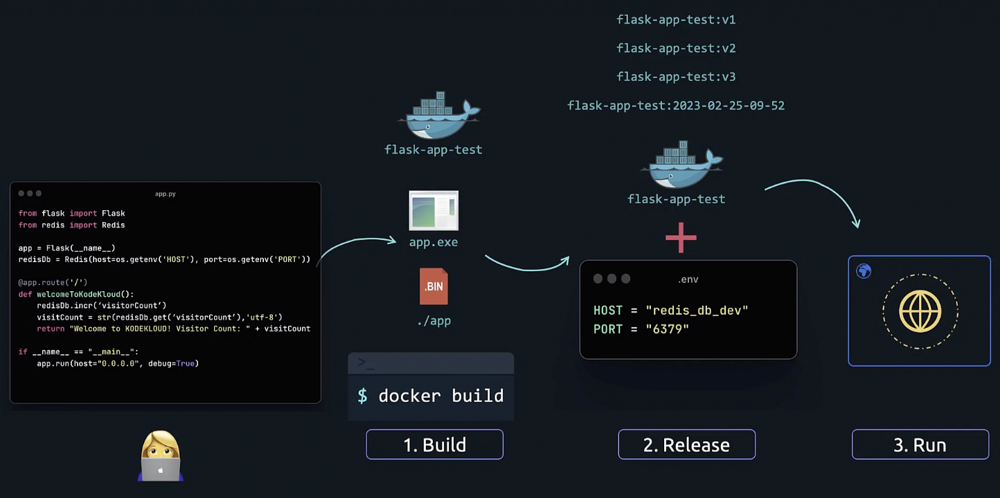
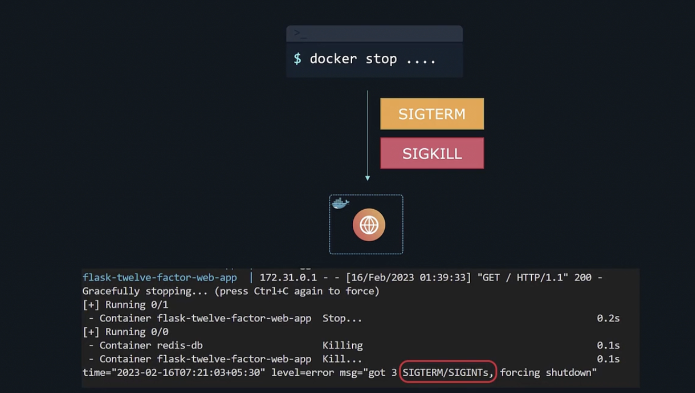
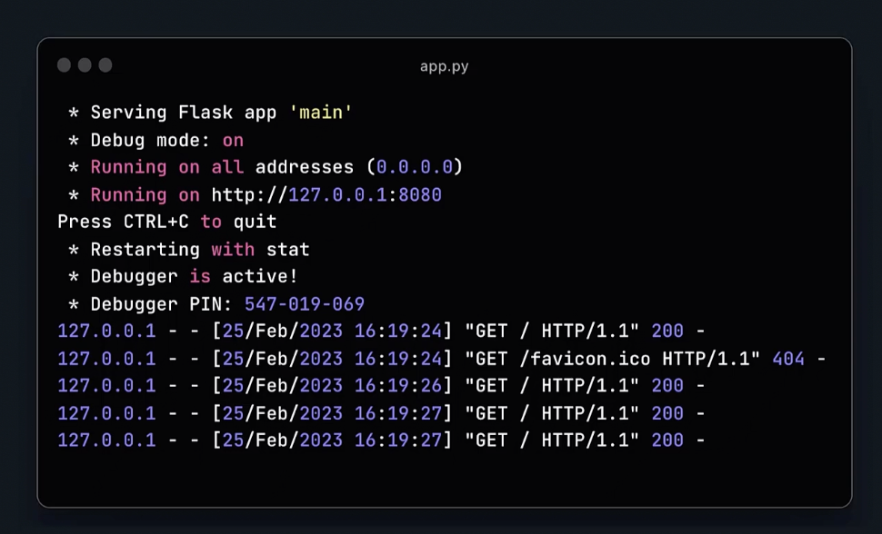

## Why 12 Factor App?

You built an application to get your idea out to the world. Traditionally, you had to go through hoops and hurdles to get your idea out to the world. It would take you days, weeks, or even months to order and receive a server to host your application on. And eventually, once you get a server to host your application on, you were dependent on that server for the rest of your life. Your application and your server were married for life.

You wrote code that could live on that server. It couldn't live on other servers. And if you had to scale, you would scale resources on that server. Heck, you even stored session information on that server. If the user was in the middle of something and your server crashed, everything that the user did until that point was lost and they had to do all of that all over again. Your app was tied to that server for life.

Fast forward many decades to today. We are living in the world of high-growth SaaS startups that see user growth from zero to millions in a matter of a few months. Going from an idea to execution only takes as much time as you need to develop the code for it. Provisioning and hosting can be achieved in a matter of hours, if not minutes. Most cloud platforms today can provision servers and other resources in a matter of minutes. And most of the time, you don't even need to worry about provisioning a server. With PaaS and serverless technologies, you can simply write code and push — you're done.

Today's platforms are expected to be up 99.999% of the time, meaning there is no time to take down the application for any reason whatsoever. No time to take down the application for patching servers, adding additional resources, or scaling. For this to happen, your application needs to break free from the underlying infrastructure. This way you can host your application anywhere you want — be it on-prem, GCP, AWS, or Azure.

And that's known as portability — the ability to run the same app on different environments without having to change the source code of the application.

When it comes to scaling, in the past, you had to take down your application to add additional resources to your servers. That was referred to as vertical scaling. Today, you provision more servers and run more instances of your application — horizontal scaling.

To summarize, modern applications need to be portable and must not be tightly coupled with the underlying infrastructure. They should have minimal divergence when deployed between dev, test, and prod environments to enable continuous deployment. They must be easily scalable by spinning up many instances at once and must be suitable for deployment on modern cloud platforms.

In order to achieve this, your application needs to be developed keeping certain principles in mind. About a decade ago, engineers from Heroku put together 12 factors that need to be considered when building modern applications. These are known as the 12-Factor App principles.

And that's what we will see with examples in the rest of the documentation. These are also documented at the 12factor.net website.

---
# Introduction to the Twelve-Factor App

In this documentation, we will explore the Twelve-Factor App methodology through a simple and easy-to-understand example using Python and the Flask web framework.

The Twelve-Factor App is a methodology for building software-as-a-service apps that:

* Use declarative formats for setup automation
* Have a clean contract with the underlying operating system
* Offer maximum portability between execution environments
* Are suitable for deployment on modern cloud platforms
* Minimize divergence between development and production
* Can scale up without significant changes to tooling, architecture, or development practices

## The 12 Factors

Here is a list of the twelve factors:

1. **Codebase** - One codebase tracked in revision control, many deploys.
2. **Dependencies** - Explicitly declare and isolate dependencies.
3. **Config** - Store config in the environment.
4. **Backing Services** - Treat backing services as attached resources.
5. **Build, Release, Run** - Strictly separate build and run stages.
6. **Processes** - Execute the app as one or more stateless processes.
7. **Port Binding** - Export services via port binding.
8. **Concurrency** - Scale out via the process model.
9. **Disposability** - Maximize robustness with fast startup and graceful shutdown.
10. **Dev/Prod Parity** - Keep development, staging, and production as similar as possible.
11. **Logs** - Treat logs as event streams.
12. **Admin Processes** - Run admin/management tasks as one-off processes.

---

In the following sections, we will go through each of these principles with basic examples using Flask to demonstrate the ideas in a concrete and approachable way.


## The 12-Factor App: Single Codebase

### I. Codebase

```app.py
from flask import Flask

app = Flask(__name__)

@app.route('/')  
def welcomeToAbukiks():
    return "Welcome to Abukiks!"

if __name__ == "__main__": 
    app.run(host="0.0.0.0", debug=True)
```

Our simple Flask app, currently residing on your laptop in the `app.py` file, is the entry point for our web application. It handles incoming and outgoing requests and displays "Welcome to Abukiks!" in a browser.

### Collaboration Challenges

As user demand grows and more developers join, collaboration becomes challenging. Developers working in isolation and copying code to a central hub leads to conflicts and inefficiencies.

### Git to the Rescue

Git helps developers collaborate efficiently on the same application. Each developer installs and configures Git, pulls the latest code from the central hub, adds their changes, and pushes them back.

### Central Hubs

Cloud-based platforms like GitHub serve as central repositories for code. GitHub allows configuration of projects, organizations, users, and access levels. GitLab and BitBucket are similar platforms.

### Codebase per Application

In the past, a single codebase often housed multiple applications and services. However, the 12-Factor App methodology dictates that each application should have its own codebase. Multiple applications sharing the same code violate this principle and should be separated.

### Multiple Deployments

Within each codebase, multiple deployments can exist for different environments such as development, staging, and production. The same codebase is used across these deployments.

---

## The 12-Factor App: Explicitly Declare and Isolate Dependencies

The second rule of the 12-Factor App methodology emphasizes that applications should **explicitly declare and isolate all dependencies**. This means your app should never rely on the implicit existence of system-wide packages. Instead, all necessary components must be clearly defined and managed to ensure consistency across various environments.

### II. Dependencies

For Python applications, you typically list dependencies in a file named `requirements.txt`. This file specifies the package names and their exact version numbers.

Here's a simple example:

```requirements.txt
flask==2.0.0
```

**Specifying the version number** is critical. Without it, different developers or deployment environments might install varying versions of a package, leading to inconsistencies and unexpected behavior. Imagine a scenario where a developer uses one version of Flask during development, but by the time the app is deployed to production, a newer version has been released. If the operations team installs the latest version without explicit versioning, your app might not function as expected.

During the build process, the command `pip install -r requirements.txt` will install all the dependencies listed in this file. The `requirements.txt` file is usually located in the **root directory** of your project.

### Isolating Dependencies

Declaring dependencies is only half the battle; isolating them is equally important. Consider developing two separate applications on your laptop where each requires a different version of the same dependency:

```App1
Flask==2.0.0
```

```App2
Flask==1.9.0
```

Without proper isolation, these differing versions could cause conflicts. To prevent this, it's a best practice to create an isolated environment for each application that includes all its necessary dependencies.

Python addresses this with **virtual environments**. A virtual environment creates a self-contained directory containing a Python interpreter and all the packages specific to that application. This approach ensures that no external dependencies interfere with your application and that the same explicit dependency packages are consistently applied across all development, staging, and production environments. With the `requirements.txt` file and Python virtual environments, you can effectively define and isolate your Python dependencies.

### Beyond Python: Universal Isolation with Docker

What about tools that your application relies on but are outside of Python's dependencies, such as the `curl` command or other system utilities? This is where a more universal solution like **Docker containers** comes into play.

Docker allows you to package your application and all its dependencies—including system tools and configurations—into a self-contained, isolated unit called a container. This offers a highly efficient and reliable way to manage dependencies across different programming languages and environments. For the remainder of this discussion, we'll focus on a Docker-based solution.

---

### Packaging with Docker

Here's how your application code, `requirements.txt` file, and a `Dockerfile` work together to package your application and its dependencies into a Docker container:

#### 1. Application Code (`app.py`)

```python
from flask import Flask

app = Flask(__name__)

@app.route('/')  
def welcomeToAbukiks():
    return "Welcome to Abukiks!"

if __name__ == "__main__": 
    app.run(host="0.0.0.0", debug=True)
```

#### 2. Dependencies (`requirements.txt`)

```requirements.txt
flask==2.0.0
```

#### 3. Dockerfile

```dockerfile
FROM python:3.10-alpine

# Set the working directory inside the container
WORKDIR /app

# Copy the requirements file and install dependencies
COPY requirements.txt .
RUN pip install -r requirements.txt --no-cache-dir

# Copy the application code
COPY . .

# Define the command to run the application
CMD python app.py
```

Let's break down the `Dockerfile`:

* `FROM python:3.10-alpine`: This line creates an image based on the lightweight Python 3.10 Alpine Linux base image.
* `WORKDIR /app`: This sets the **working directory inside the container** to `/app`. This is a common and clear convention.
* `COPY requirements.txt .`: This copies the `requirements.txt` file from your local project's root directory **to the current working directory (`/app`) inside the container**.
* `RUN pip install -r requirements.txt --no-cache-dir`: This command installs all the Python dependencies listed in `requirements.txt` inside the container. The `--no-cache-dir` flag helps keep the image size smaller by preventing pip from caching downloaded packages.
* `COPY . .`: This copies all the remaining files from your local project's root directory (including `app.py`) **to the current working directory (`/app`) inside the container**.
* `CMD python app.py`: This defines the command that will run your application when the container starts.

By running the `docker build` command (e.g., `docker build -t my-flask-app .`), you create a Docker image that encapsulates your application and all its dependencies. Subsequently, running `docker run` (e.g., `docker run -p 5000:5000 my-flask-app`) will launch an instance of your application within a self-contained, isolated Docker container.

This approach ensures that your application always runs with its exact specified dependencies, regardless of the underlying system, fully embracing the 12-Factor App principle of explicitly declaring and isolating dependencies.

---

## The 12-Factor App: Scale out via the process model

### VIII. Concurrency

So, number eight in the 12-Factor App is **concurrency**. We've already discussed containerizing our application and running it as a Docker container. This executes one instance, or one process, of our application, and this instance is able to serve several users. But what happens when we have more users visiting our site? We previously talked about scaling up resources vertically by increasing the resources to the server. However, that requires taking down the server, causing downtime, and we'll ultimately hit a maximum limit on the resources that can be added to that server.

With new servers now accessible within minutes, we can provision more servers and spin up more application instances with great ease. We can then use a **load balancer** to distribute the load across these different application instances. However, for this to work as expected, we must build our application as an independent, **stateless app**. In the 12-Factor App, processes are a first-class citizen. Applications should **scale out horizontally**, not vertically, by running multiple instances of the application concurrently. The application itself should be built with this in mind. We'll discuss more about what that means for processes in the following documentation.

---

## The 12-Factor App: Execute the app as one or more stateless processes

12-Factor processes are **stateless and share nothing**. Let's see what that means. Imagine we've decided to add a new feature to our app: showing a visitor count on our website. Every time a new visitor comes to our page, we'd like to display the total visitor count. For this, we might update our code to include a `visitCount` global variable and increment it each time a request comes in:

```python
from flask import Flask

app = Flask(__name__)

visitCount = 0

@app.route('/')  
def welcomeToAbukiks():
    global visitCount
    visitCount+=1
    return "Welcome to Abukiks!"

if __name__ == "__main__": 
    app.run(host="0.0.0.0", debug=True)
```

---

### VI. Processes

This approach works well when you have one process running, because the `visitCount` is stored in the memory of that single process. But when you run multiple processes, they each have their own version of this variable stored in them. As a result, different users might see different numbers, depending on which process served them.

The same issue applies to other details, such as user session information. When a user logs into our website, we store certain session information about that user, such as where they logged in from, when their login expires, and so on. This session information is needed on the server to keep that user logged in. But if this is stored in the process memory or locally in the file system of that process, then if a future request from that user is directed to another process, the user might be considered logged out because the session information isn't available there.

Some load balancers are session-aware and can redirect users to the same process each time. This is called **sticky sessions**. However, this is still problematic if, for some reason, the process crashes, as all locally stored data will be lost. This is why 12-Factor processes are **stateless and share nothing**. Sticky sessions are a violation of the 12-Factor methodology and should never be used or relied upon.

Instead, we must not store anything in these processes. All data and session information should be stored in an **external backing service**. This way, all data is stored in a place that can be easily accessed by all processes. It doesn't matter which process a user is routed to; it's as if all requests are handled by the same process, as all processes now have access to the same set of data. This external service could be a database or a caching service like Redis.

So, we modify our code to store the visit count in a Redis database:

```python
from flask import Flask
from redis import Redis

app = Flask(__name__)
redisDb = Redis(host='redis-db-', port=6380)

@app.route('/')  
def welcomeToAbukiks():
    redisDb.incr('visitorCount')
    visitorCount = str(redisDb.get('visitorCount'), 'utf-8')
    return "Welcome to Abukiks! Visitor count: " + visitorCount

if __name__ == "__main__": 
    app.run(host="0.0.0.0", debug=True)
```

This change now allows us to run as many instances of our application as required while ensuring we store nothing locally and enabling all instances to point to the same count.

---

## The 12-Factor App: Treat Backing Services as Attached Resources

### IV. Backing Services

So let's look at number four, backing services. So we integrated Redis as a caching service to our app to store the visitor count. There may be other similar services such as an SMTP service to send emails and S3 integration to store images. And all of these are backing services and must be treated as attached resources.

What does that mean? Let's take the example of integration with Redis. Redis is an attached resource for our app and irrespective of where it is hosted, maybe locally or in a cloud environment, or maybe a Redis managed service, wherever it may be, it should work without having to change our application code. You shouldn't have anything in the code that is specific to a locally hosted Redis service, or a remotely hosted Redis service for that matter. We should be able to point our app to another instance, and it should just work.

---

## The 12-Factor App: Store Config in the Environment

### III. Config

So the next factor is **Config**. As you may have noticed, our Python code includes hard-coded Redis host and port values. This presents a problem when deploying the application to different environments such as production, staging, and development, as each environment may use a different Redis instance, requiring changes to the host and port values. This is not considered a best practice, as it can lead to inconsistencies and errors when deploying to different environments.

#### Original App.py

```python
from flask import Flask
from redis import Redis

app = Flask(__name__)
redisDb = Redis(host='redis-db-', port=6380)  # hardcoded Redis host and port values

@app.route('/')  
def welcomeToAbukiks():
    redisDb.incr('visitorCount')
    visitorCount = str(redisDb.get('visitorCount'), 'utf-8')
    return "Welcome to Abukiks! Visitor count: " + visitorCount

if __name__ == "__main__":
    app.run(host="0.0.0.0", debug=True)
```

#### .env

```
HOST="redis_db"
PORT="6379"
```

#### Updated App.py with Environment Variables

```App.py
from flask import Flask
from redis import Redis
import os

app = Flask(__name__)
redisDb = Redis(host=os.getenv('HOST'), port=os.getenv('PORT'))

@app.route('/')  
def welcomeToAbukiks():
    redisDb.incr('visitorCount')
    visitorCount = str(redisDb.get('visitorCount'), 'utf-8')
    return "Welcome to Abukiks! Visitor count: " + visitorCount

if __name__ == "__main__":
    app.run(host="0.0.0.0", debug=True)
```

To ensure that our environment configurations are separate from our main application code and not under version control, we keep them in a separate file named `.env` and load them as environment variables in the app.

> The 12-Factor App stores config in environment variables.

This approach allows us to:

* Use different configurations for different environments such as testing, staging, or production.
* Avoid hard-coding sensitive or environment-specific values.
* Open source the project at any time without exposing sensitive configuration information.
* Eliminate the need for code-level changes between environments.

Keeping configuration in the environment promotes flexibility, security, and cleaner deployment workflows.

---

# The 12-Factor App: Strictly Separate Build and Run Stages

## Release and Run

One of the recent changes pushed resulted in a typo in the message shown in the browser. This needs to be fixed ASAP. How do we roll back the recent change without really having to push another commit?

Now in this case, since the code base is small and the issue is only a typo, it might look easier to just push another commit to the code fixing the typo. And we need to do that, of course, at some point.

```python
# App.py
from flask import Flask
from redis import Redis
import os

app = Flask(__name__)
redisDb = Redis(host=os.getenv('HOST'), port=os.getenv('PORT'))

@app.route('/')  
def welcomeToAbukiks():
    redisDb.incr('visitorCount')
    visitorCount = str(redisDb.get('visitorCount'), 'utf-8')
    return "Welcome to Abukisk! Visitor count: " + visitorCount

if __name__ == "__main__":
    app.run(host="0.0.0.0", debug=True)
```

## V. Build, Release, Run

However, in larger and complex environments, you may not have enough time to push such changes and wait for it to get rebuilt and tested and deployed. This is possible if we have a clear separation of build and run phases.

So let's first walk you through the different stages of a release cycle. The 12 Factor App uses **strict separation** between the **build**, **release**, and **run** stages. Let's see what these stages are first.

### Build Phase

The current workflow involves the development phase where you write your code on your laptop. This could be on your favorite text editor like VS Code or PyCharm.

And now the code in the text format is not good enough to be run. To run it as an application by the end user, it needs to be in an executable format — like an `.exe` file in Windows or a binary file in Linux. This could also be a Docker image as it is in our case.

Converting the code from a text format to a binary or executable format is known as **building the code**. Tools for this include:

* Python: `setuptools`
* Java: `Maven`, `Gradle`
* Docker: `docker build`

We use `docker build` to build a Docker image for the application using our Dockerfile.

### Release Phase

Once built, the executable **along with the config file for its environment** becomes the **release object**.

> A combination of the executable + environment configuration = Release Object

Each release should have a **unique release ID** — this could be a version (`v1`, `v2`) or a timestamp. Any minor code change (like a typo) should create a **new release**.

### Run Phase

This is where the release object is **run in its respective environment**. The exact same build is used across environments to ensure consistency.

> Minor code change → New build → New release → New deployment



By clearly separating our **build** and **run** phases:

* We can effectively manage build artifacts and deployments
* We can store artifacts in designated locations
* We can **roll back** to previous releases easily
* We can redeploy a specific release if needed

---

✅ **The strict separation of build and run stages is a key principle within the 12 Factor App methodology.**

---

# The 12-Factor App: Export Services via Port Binding

In previous steps, you have noticed that accessing our Flask web application was as simple as typing the URL and port number in a web browser on your local machine. In this case, it's `5000`. This is because the Python Flask framework listens on port `5000` by default.

Now, if we were running multiple instances of our application on the same server, we should be able to bind the app to other ports on the server, such as `5001`, `5002`, etc. Other services may have similar port bindings configured. For example, Redis listens on port `6379`.

## VII. Port Binding

Our app exports HTTP as a service by binding to a specific port and listening for incoming requests on that port.

Unlike traditional web applications, **the 12-Factor App is completely self-contained and does not rely on a specific web server to function**.
---

# The 12-Factor App: Maximize Robustness with Fast Startup and Graceful Shutdown

The next one is **disposability**. The 12-Factor App's processes are disposable, meaning they can be started or stopped at a moment's notice.

Earlier we talked about scaling. A 12-Factor App should be able to scale up to provision additional instances when requirements increase, ideally in a matter of seconds. For this to happen, processes should strive to **minimize startup time**, meaning you shouldn't rely on complex startup scripts to provision your app.

## IX. Disposability

The same is true for reducing instances when load decreases.

> Processes should be disposable when no longer required. The 12-Factor App's processes should shut down gracefully when they receive a SIGTERM signal from the process manager.

So let's see what that means.

When the `docker stop` command is initiated, Docker first sends the `SIGTERM` signal and after a grace period, if the container is not stopped, Docker sends the `SIGKILL` signal to forcefully terminate the process running inside the container.

So why the two signals? We want to allow the application enough time to shut down gracefully. Our application may be processing requests from hundreds of users at a time.

A graceful shutdown allows the application enough time to stop accepting new requests, while also completing processing of all existing requests. This way, users who are waiting for a response from the app are not impacted.

For this, the app should be able to handle the `SIGTERM` signal to avoid any unexpected data loss or resource leaks that can occur if the process is terminated forcefully with a `SIGKILL` signal.

Here is an example of a Flask application accepting the `SIGTERM` signal and then terminating the process:




---

# The 12-Factor App: Keep Development, Staging, and Production as Similar as Possible

The next one is **dev-prod parity**. Earlier, we talked about three different environments where the application will be deployed.

* The **dev environment** is where the application is developed by developers to test changes during the development phase.
* The **staging environment** is where it is deployed to be tested against a production-like setup.
* The **prod environment**, of course, is where the application is hosted to be accessed by users.

Traditionally, it would take changes built by developers in the development environment **weeks or even months** to go into production. You had:

* One set of people write code.
* Another set of people deploy it in a production environment.
* One DB used in dev, such as a lightweight database like **SQLite**, and another one in prod, such as **PostgreSQL**.

So there is a **time gap** for the time it takes code to go from dev to prod environment.
And the problem with that is there may be **other things changing in the app** from the time that it was developed to the time it goes into production that might affect the functionality of the change.

There is a:

* **Personnel gap**, when the ops people deploying the change have little to no knowledge of the new changes, making it hard to identify issues caused by the new changes.
* **Tools gap**, where different tools used in different environments may lead to unexpected consequences when deployed in production.

---

## X. Dev/prod parity

This is where the 10th principle of the 12-Factor App comes in. It is about the **parity between different environments**.

> The 12-Factor App is designed for Continuous Deployment by keeping the gap between development and production small.
> The 12-Factor App developer resists the urge to use different backing services between different environments.

With **continuous integration**, **continuous delivery**, and **deployment tools**, today we are able to reduce the time it takes for changes to go from dev to production environments in a matter of **hours**, or even **minutes** in some cases.

* The developer who writes code should also be involved in deploying and watching it in production environments.
* With tools, we must aim to keep the same tool as much as possible.
* With modern tools being lightweight and **containerization tools like Docker**, making it easy to set up development environments, this shouldn't be hard to achieve.

---

# The 12-Factor App: Treat Logs as Event Streams

Let's now talk about logs. Our application outputs certain logs about the processes — starting the port it's listening on, and every request that comes in and is served by the server is logged as a separate line. The logs also capture any errors in code, which helps troubleshoot issues if there are any failures.

Traditionally, applications followed different approaches to storing logs.



One approach was to write the logs to a local file, named something like `log file`. The problem with this approach is that in the world of containers, the container may be killed at any time and the logs would be lost. Moreover, the application is coded to write to specific log files on the file system, which is another problem.

In other cases, applications try to push logs to certain centralized logging systems like **Fluentd**, and while centralized management of logs is encouraged, tightly coupling a specific logging solution to the app itself is discouraged. We do not want our app to be stuck to a single solution.

For example, having code that sends logs directly to a specific logging provider is **discouraged**.

## XI. Logs

The **11th principle** in the 12-Factor App methodology is about **logs management**.

> A 12-Factor App never concerns itself with routing or storage of its output stream.

Logs should be:

- Stored in a centralized location in a **structured format**.
- Not written to specific files or tied to a specific logging solution.
- Emitted to `stdout` or written locally in **structured JSON format**.

This makes it easier for agents to pick up the logs and send them to a centralized location for **consolidation and analysis**.

Some good examples of centralized logging solutions include:

- **ELK Stack**
- **Splunk**

All logs must follow a **structured format** to make them easy to query and analyze.
---

# The 12-Factor App: Run admin/management tasks as one-off processes

The last and final principle in the 12 Factor App is about **admin processes**. So this is how our setup looks like right now: the Redis database stores the count of total visitors.

Say, for some reason, we realize that this number is inaccurate or that we want to reset it. We need a way to get into the app and reset the count as a one-time operation.

Now this is a one-time admin or management task that we will have to perform using a script like this. And we may have similar tasks, such as migrating databases or fixing specific user records, etc.

The **admin processes** principle of the 12 Factor App methodology suggests that administrative tasks should be kept **separate from the application processes**. Specifically, it recommends that any one-off or periodic administrative tasks—such as database migration or server restarts—should be run as a separate process or application.

However, it should be run on **identical systems** as the app running in the production environment. In our example, we could spin up another Docker container to connect to the same Redis database and run the reset script to reset the numbers.

---

## XII. Admin Processes

The **admin processes** principle of the 12 Factor App methodology recommends that administrative tasks should be:

* **Kept separate** from the application processes
* Run in an **identical setup** as the main app
* Be **automated**, **scalable**, and **reproducible**
